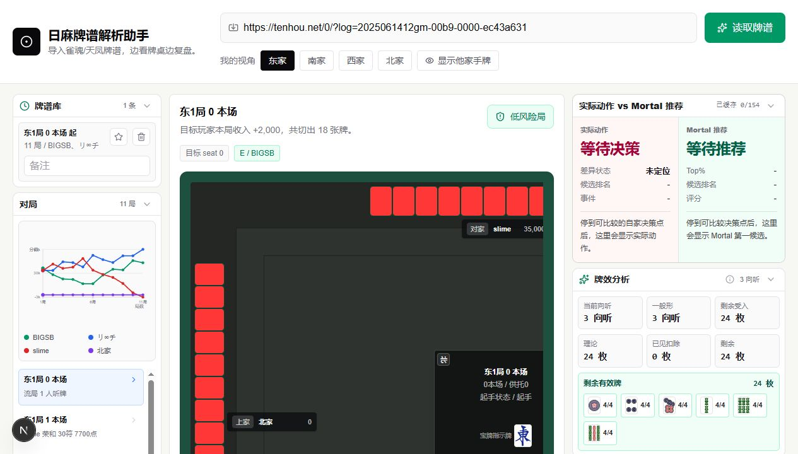
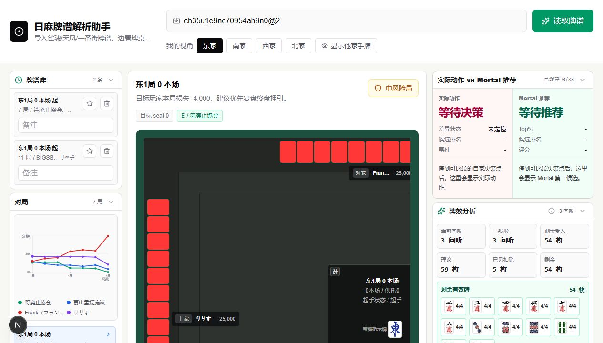

# Mahjong Paipu Assistant

本地优先的日麻牌谱回放与复盘工具。粘贴牌谱链接或记录 ID 后，可以在同一套桌面、时间轴、决策点和分析面板里查看牌局。



## 主要能力

- 支持雀魂国服 / 国际服、天凤公开牌谱、麻雀一番街公开记录。
- Tenhou 风格四人桌回放，支持桌面和移动端布局。
- 展示四家手牌、牌河、副露、宝牌、立直棒、分数走势和事件时间轴。
- 解析吃、碰、明杠、暗杠、加杠、抢杠等关键事件。
- 提取候选决策点，支持和 Mortal 或其他本地引擎结果对照。
- 可选接入 OpenAI 兼容 LLM，对当前局面做摘要和追问。

## 支持的输入

```text
雀魂国服:
https://game.maj-soul.com/1/?paipu=...

雀魂国际服:
https://mahjongsoul.game.yo-star.com/?paipu=...

天凤:
https://tenhou.net/0/?log=...
https://tenhou.net/6/?log=...
2025061412gm-00b9-0000-ec43a631

麻雀一番街:
ch35u1e9nc70954ah9n0
ch35u1e9nc70954ah9n0@2
```

`@2` 这类后缀用于指定目标玩家座位。天凤和一番街 v1 以公开四麻普通东 / 南牌谱为主，特殊规则和私有牌谱会明确报错。



## 项目定位

这是一个偏本地、偏研究用途的开源回放工具，不是完整线上服务平台。

公开仓库包含：

- 牌谱 URL / ID 识别、下载和归一化。
- 回放 UI、时间轴、决策点和本地分析链路。
- 可选 LLM 与本地 Mortal sidecar 适配。
- 单元测试、非敏感 fixture 和公开文档。

公开仓库不包含：

- 用户账号系统、后台管理、充值、钱包、支付、额度或计费逻辑。
- 商业数据库迁移、生产部署密钥或内部运维脚本。
- `.env.local`、cookies、真实 token、私钥、私有日志。
- Mortal 模型权重、本地引擎二进制或第三方私有源码。

边界细节见 [docs/open-source-boundary.md](docs/open-source-boundary.md)。

## 环境要求

- Node.js 20 或更高版本
- npm
- 可访问目标牌谱来源的网络环境
- 可选：OpenAI 兼容 LLM API Key
- 可选：本地 Mortal 兼容引擎或 HTTP 服务

## 快速开始

```bash
npm install
cp .env.example .env.local
npm run dev
```

访问 [http://localhost:3000](http://localhost:3000)，然后粘贴牌谱链接或记录 ID。

雀魂需要在 `.env.local` 里配置你自己的账号或会话信息。天凤公开牌谱和麻雀一番街公开记录通常不需要账号。

```env
MAJSOUL_ACCOUNT=
MAJSOUL_PASSWORD=
MAJSOUL_REGION=cn
```

雀魂国际服可手动配置 Yostar 会话字段：

```env
MAJSOUL_REGION=en
MAJSOUL_EN_YOSTAR_UID=
MAJSOUL_EN_YOSTAR_TOKEN=
MAJSOUL_EN_YOSTAR_DEVICE_ID=
```

真实密钥、token 和账号信息请只放在 `.env.local`，不要提交到仓库。

## 配置说明

完整环境变量见 [.env.example](.env.example)。

- `MAJSOUL_*`：雀魂登录、区域、网关和代理配置。
- `ANALYSIS_ENABLE_ENGINE`、`MORTAL_ENGINE_URL`：本地引擎开关与端点。
- `MORTAL_COMMAND_TEMPLATE`、`MORTAL_WORKER_COMMAND_TEMPLATE`：本地 sidecar 命令模式。
- `ANALYSIS_LLM_*`：OpenAI 兼容聊天接口。

## Mortal 本地使用

网页端通过 HTTP 端点调用 Mortal 或其他专业麻将引擎：

```text
POST MORTAL_ENGINE_URL
```

仓库提供 `scripts/mortal-sidecar.mjs` 作为本地 sidecar。它会把当前局面转换为 mjai JSON Lines，调用你配置的引擎命令或 worker，再把结果映射回前端。

```bash
npm run mortal:sidecar
```

推荐配置：

```env
ANALYSIS_ENABLE_ENGINE=true
MORTAL_ENGINE_URL=http://127.0.0.1:4010/analyze
MORTAL_SIDECAR_HOST=127.0.0.1
MORTAL_SIDECAR_PORT=4010
MORTAL_WORKER_COMMAND_TEMPLATE=
MORTAL_COMMAND_TEMPLATE=
```

更多说明见 [docs/mortal-engine-local-dev.md](docs/mortal-engine-local-dev.md)。

## LLM 对话

LLM 是可选能力。配置 OpenAI 兼容端点后，可以围绕当前局面追问：

```env
ANALYSIS_LLM_BASE_URL=https://api.openai.com/v1
ANALYSIS_LLM_API_KEY=
ANALYSIS_LLM_MODEL=
ANALYSIS_LLM_FLASH_MODEL=
ANALYSIS_LLM_PRO_MODEL=
```

如果未配置，应用会退回本地确定性摘要，不影响牌谱回放和 Mortal 分析。

## 常用命令

```bash
npm run dev
npm run build
npm run lint
npm test
npm run test:fixtures
npm run mortal:sidecar
```

## 项目结构

```text
src/app/                      Next.js 应用与公开 API
src/components/paipu/         回放与分析 UI
src/lib/majsoul/              牌谱解析、回放、分析、LLM/引擎适配
scripts/mortal-sidecar.mjs    本地 Mortal HTTP sidecar
scripts/mortal-*.py           可选的本地 Mortal 适配脚本
public/mahjong-tiles/         本地牌面 SVG 资源
fixtures/                     非敏感测试数据
docs/                         公开仓库说明文档
```

## 发布前检查

```bash
npm test
npm run lint
npm run build
git status --short
```

敏感字段扫描可参考 [docs/release-checklist.md](docs/release-checklist.md)。占位变量名可能被命中，真正的值不要提交。

## 许可证

MIT，见 [LICENSE](LICENSE)。

## 免责声明

本项目与雀魂、Yostar、天凤、麻雀一番街、Catfood Studio、Mortal 或 MahjongCopilot 没有从属关系。请使用你自己的账号、引擎和 API Key，并遵守相关第三方条款与许可。
